import Toc from '../../components/blog/Toc.astro';

<Toc>
- [The Impressive Jewelers of Optimystical Studios](#TheImpressiveJewelersofOptimysticalStudios)
- [The Ridiculously Cute Plushies of Nausicaa Distribution](#TheRidiculouslyCutePlushiesofNausicaaDistribution)
- [The Awesome Graphics of Megan Lee](#TheAwesomeGraphicsofMeganLee)
- [The Devastating Wit of Bootees](#TheDevastatingWitofBootees)
- [The Mathematically Inspirational Earrings of artStudio88](#TheMathematicallyInspirationalEarringsofartStudio88)
- [The Magnificent Work of Michelle Mach](#TheMagnificentWorkofMichelleMach)
- [The Fabulous Cross Stitch Patterns of Mathysphere](#TheFabulousCrossStitchPatternsofMathysphere)
- [The Seriously Sciency Gifts of We The Sciencey](#TheSeriouslySciencyGiftsofWeTheSciencey)
- [Math Gifts from Maths Gear for the Serious Numberphile](#MathGiftsfromMathsGearfortheSeriousNumberphile)
- [Science Gifts are Amazing](#ScienceGiftsareAmazing)

</Toc>

Science gifts aren’t always easy to find. So, when you come across a shop that gets it. You want to throw as much support
 them as possible. The following list features some of my favorite items that I have purchased over the years.

You will be supporting small businesses if you purchase anything on this list. Each store is managed by a creator who 
loves math and science as much as you do.

I hope you will find these science gifts as interesting as I have.

## 1. The Impressive Jewelers of Optimystical Studios

I have purchased so many items of jewelry from this store. The owners are local to Portland, and I love supporting artists 
from the community. I’ve 
[purchased most of my charms](https://www.optimysticalstudios.com/product-category/culture/science/math-science-charms/) from them at
 one point or another. I really should ask for a wholesale discount!

Here are a few of my favorite pieces from their shop:

### Elements

[Noble Gas Earrings](https://www.optimysticalstudios.com/product/noble-gas-crystals/)

These earrings are so shiny and make me feel so glam

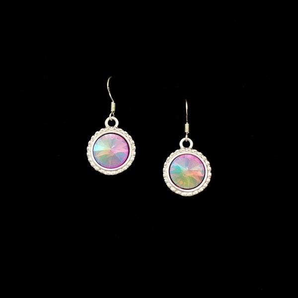

I like to wear this pendant and see if anyone gets it.

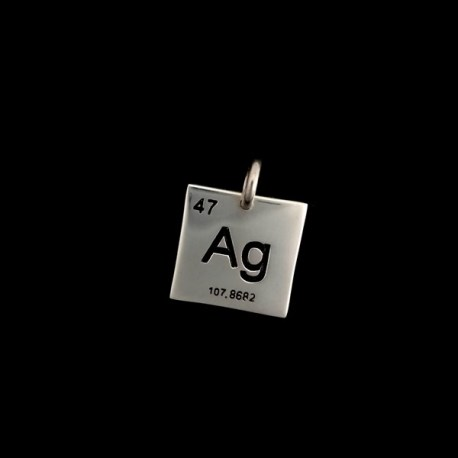

### Ladies of Science

[A series of portraits of female scientists created by women](https://www.optimysticalstudios.com/product-category/culture/science/ladies-of-science/)

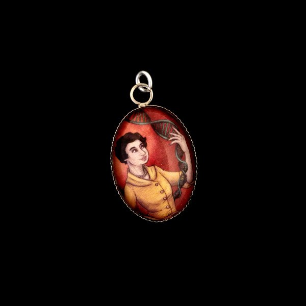

**Bonus**

Not science-related, but still cool.

They make [wonderful custom jewelry](https://www.optimysticalstudios.com/product/americas-favorite-fighting-frenchman/). 
I fell in love with this necklace representing the character of Lafayette from Hamilton.

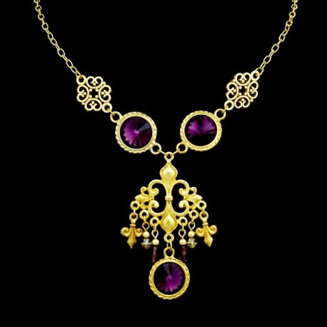

## 2. The Ridiculously Cute Plushies of Nausicaa Distribution

I felt so lucky when Nicole agreed to do an interview with me about her shop. It has a distinct statistical flavor. 
Not surprisingly, the owner has a Master's degree in Statistics! Legit. Nicole makes 
[adorable Normal Distribution plushies](https://www.etsy.com/shop/NausicaaDistribution?ref=l2-shopheader-name&section_id=6067670). 
You won't feel anxious hugging these plush toys.

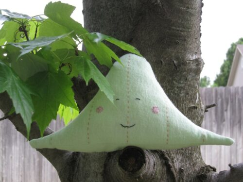

I purchased [this T-shirt](https://www.etsy.com/listing/153273880/statistics-crown-t-shirt?ref=shop_home_active_9) this year.

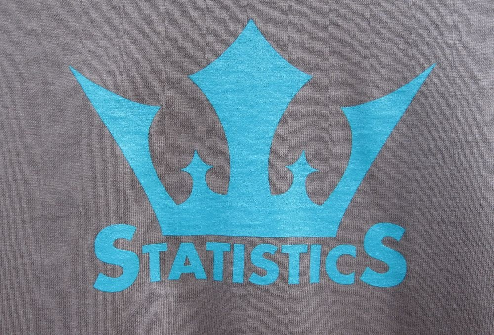

I’ve also made [this cross-stitch pattern](https://www.etsy.com/listing/59353502/significantly-not-normal-cross-stitch?ref=shop_home_active_3).

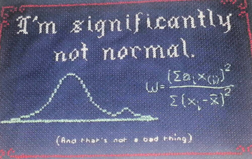

You may also like my interview with Life Through a Mathematcian's Eyes.

##  3. The Awesome Graphics of Megan Lee

Hanging in my bedroom are five portraits of the scientists who have impacted my life the most. All gorgeously designed by Megan Lee. I also have her poster featuring 16 women scientists.

I just discovered that she makes custom items. Is a [G.H Hardy poster](https://beautyofmathematics.com/truth-hardy/) in my future?

[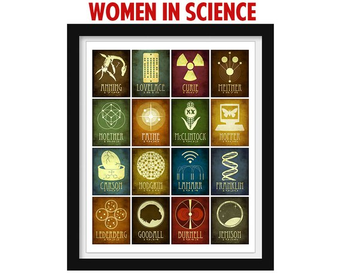](https://www.etsy.com/listing/213142340/women-in-science-art-print-scientist?ref=shop_home_feat_2&bes=1)

[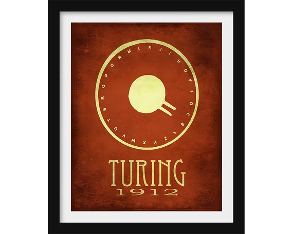](https://www.etsy.com/listing/90973640/alan-turing-computer-science-gift-geek)

[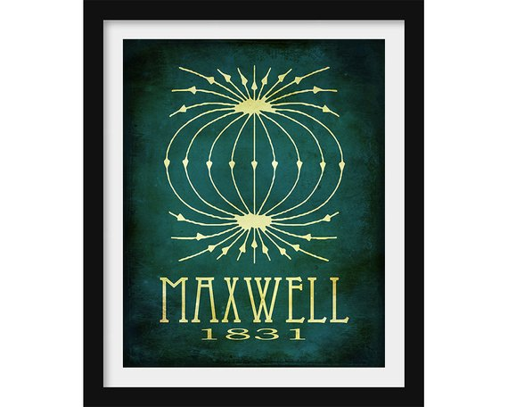](https://www.etsy.com/listing/83231540/physics-art-science-poster-james-maxwell)

[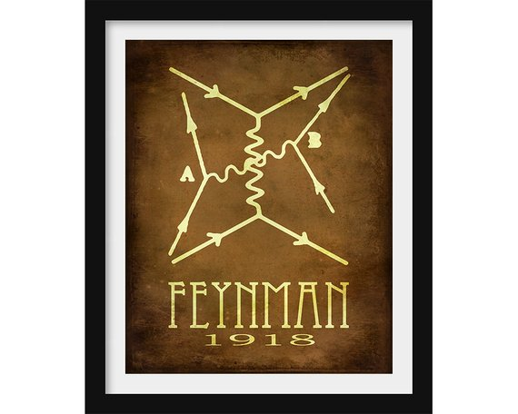](https://www.etsy.com/listing/89261444/richard-feynman-physics-gift-physics)

[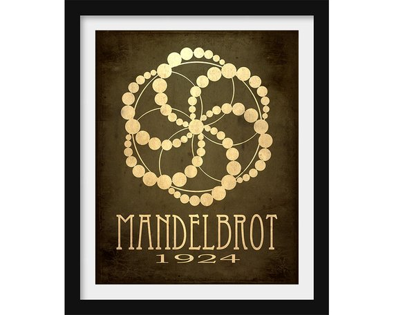](https://www.etsy.com/listing/106370152/mandelbrot-math-art-print-famous)

These posters really send the message that you love math!

## 4. The Devastating Wit of Bootees

I was searching for math and science gifts on Etsy and [found a t-shirt](https://www.etsy.com/listing/265839630/funny-science-t-shirt-t-shirt-tee-mens?ref=shop_home_active_1&crt=1) that I could not believe exists. Electromagnetism is one of my favorite things in science...

It’s no joke.

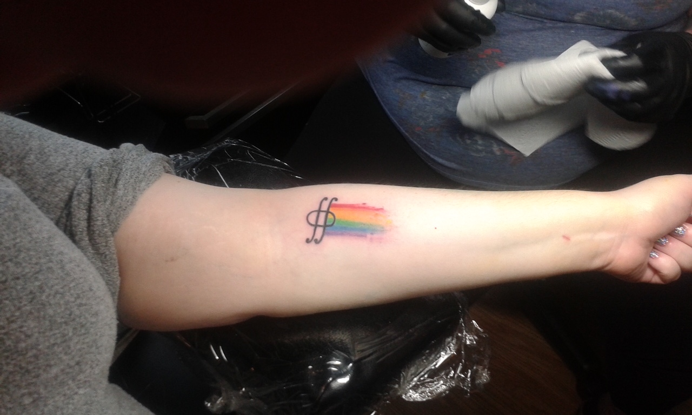

So, I had to get this.

[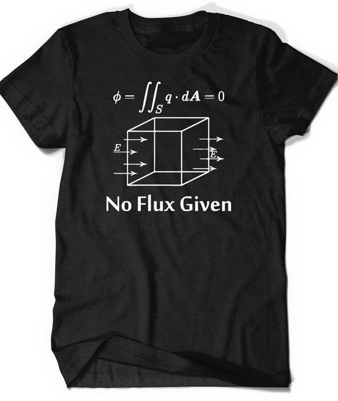](https://www.etsy.com/listing/265839630/funny-science-t-shirt-t-shirt-tee-mens?ref=shop_home_active_1&crt=1)

##  5. The Mathematically Inspirational Earrings of artStudio88

This list needs more math gifts! I will give a warning that if you visit this shop it is somewhat NSFW.
 They sell all types of piercings. Just saying. But it is totally worth a visit to pick up these math earrings.

[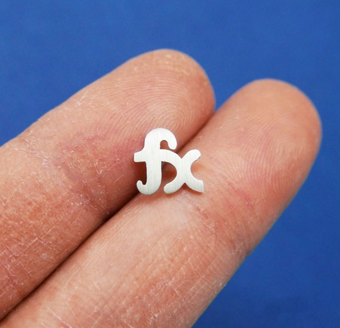](https://www.etsy.com/listing/454521856/atiny-sterling-silver-maths-functionsx)

[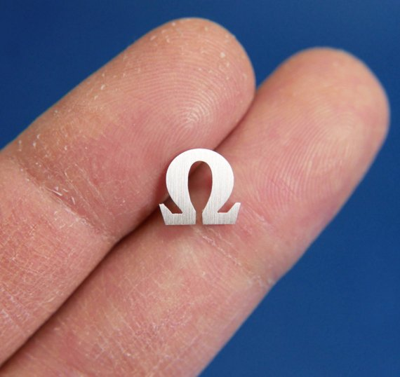](https://www.etsy.com/listing/501583655/atiny-sterling-silver-maths-omega)

[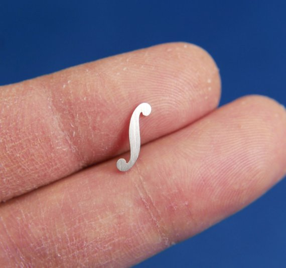](https://www.etsy.com/listing/501581527/atiny-sterling-silver-maths-integral)

[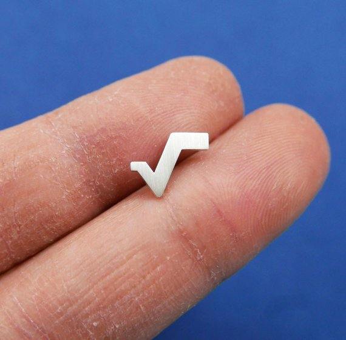](https://www.etsy.com/listing/454523150/a925-sterling-silver-radical-sign-ear)

[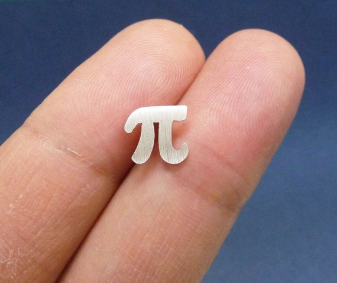](https://www.etsy.com/listing/251791552/a-tiny-sterling-silver-pi-stud-earrings)

[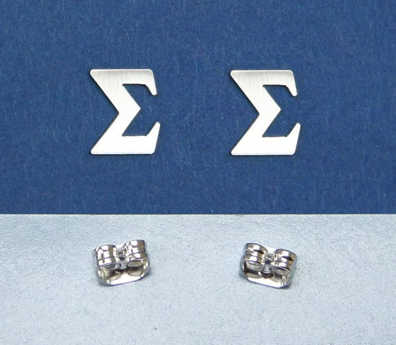](https://www.etsy.com/listing/468004043/a-tiny-sterling-silver-sigma-sign-stud)

## 6. The Magnificent Work of Michelle Mach

Michelle is also a talented jewelry maker. Her pieces are beautiful. I picked up this ring which features the [digits of Pi](https://www.etsy.com/listing/230466614/pi-ring-science-jewelry-mathematics?ref=shop_home_active_31).

[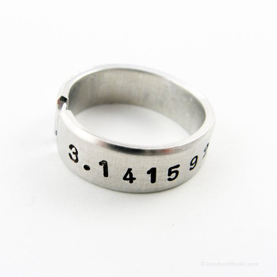](https://www.etsy.com/listing/230466614/pi-ring-science-jewelry-mathematics)

She also sells many other [math and science items](https://www.etsy.com/shop/michellemach?section_id=18819234)!

##  7. The Fabulous Cross Stitch Patterns of Mathysphere

I run an Etsy shop that sells mathematical bookmarks. I am currently on hiatus while I work on creating more inventory. 
[Check out Mathysphere](https://www.etsy.com/shop/Mathysphere?ref=l2-shopheader-name) if you like that style. 
Geri has wonderful patterns including some that are pride friendly. Really cool. I bought two patterns myself.

[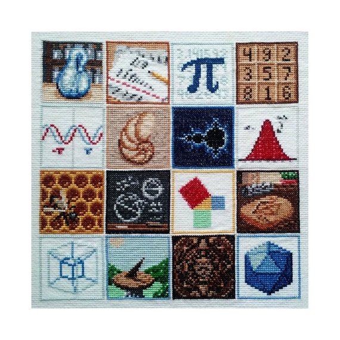](https://www.etsy.com/shop/Mathysphere?ref=l2-shopheader-name)

##  8. The Seriously Sciency Gifts of We The Sciencey

I've started using a journal/diary/planner hybrid using the [Bullet Journal method](https://bulletjournal.com/). My favorite thing is to decorate my entries. I've picked up several math gifts from [Tesla's Etsy shop](https://www.etsy.com/shop/WeTheSciencey?ref=l2-shopheader-name) for just that reason.

[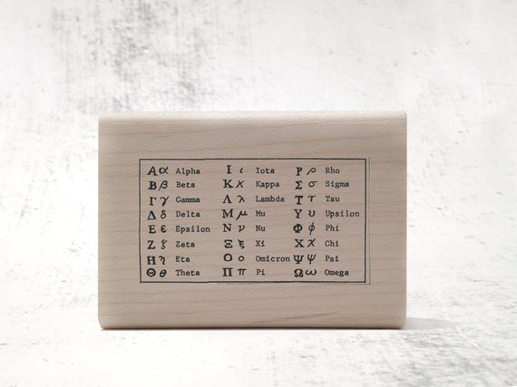](https://www.etsy.com/listing/198991912/greek-math-symbols-rubber-stamp-greek)

[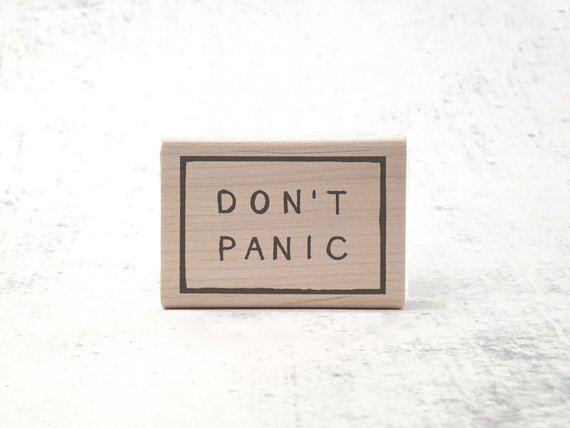](https://www.etsy.com/listing/198998985/dont-panic-rubber-stamp-hhgttg)

[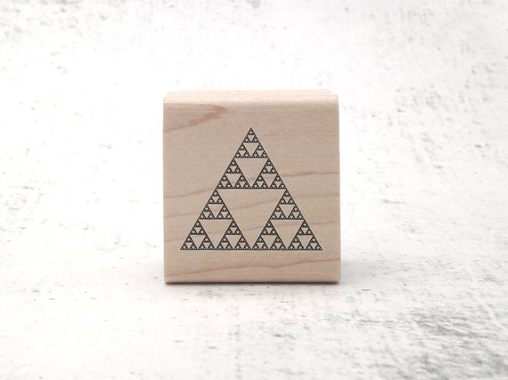](https://www.etsy.com/listing/199085513/sierpinski-triangle-rubber-stamp-fractal)

##  9. Math Gifts from Maths Gear for the Serious Numberphile

This is your shop if you are looking for pure mathematical gifts. There is some amazingly creative stuff in there. And, they sell out. They are based out of the UK but they will ship to the US.

As a role-player, I had to add these special [non-transitive dice](https://mathsgear.co.uk/collections/dice/products/non-transitive-grime-dice) to my collection. I can't use them for games.
 Entertaining to bring out when you are waiting for something though.

##  Science Gifts are Amazing

Science gifts are more plentiful than we may think. For example, Etsy is a popular marketplace for science, 
mathematics, and other unique gifts. When you purchase from them, you are supporting small businesses - making it a win/win for everyone.
 If you liked this post, consider subscribing.

Have you found any interesting shops that sell science gifts?

You can also make one of these [mathematical cross stitch patterns](https://beautyofmathematics.com/15-mathematical-cross-stitch-patterns/)
 for yourself or as a gift to a friend.
